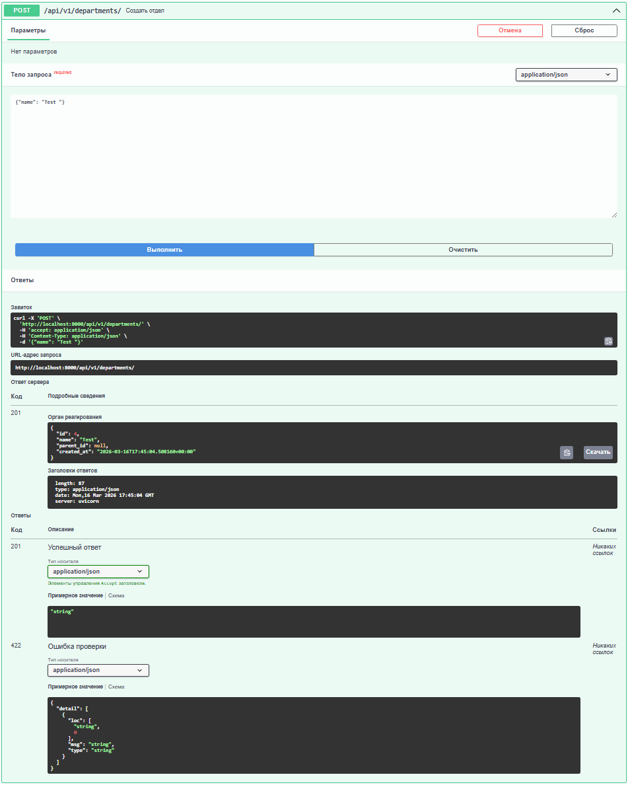
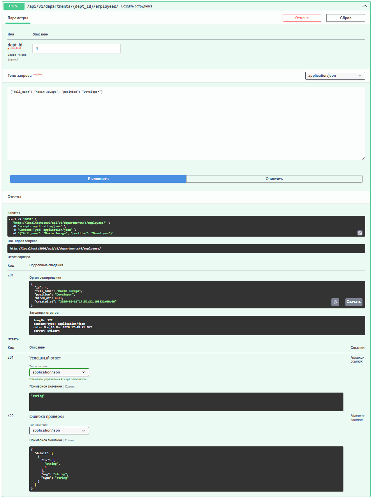
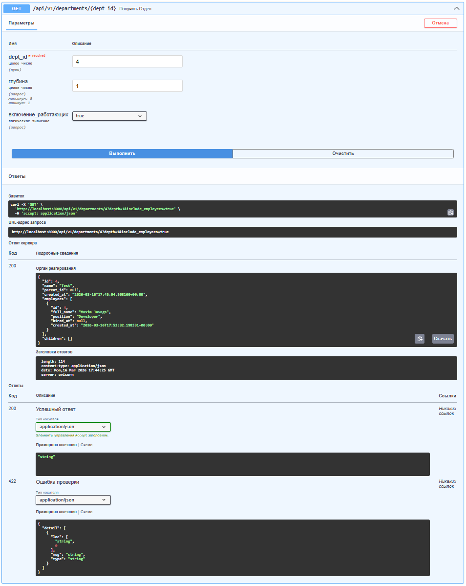

# API Организационной Структуры

FastAPI сервис для управления подразделениями и сотрудниками с поддержкой иерархической структуры

##  Описание

REST API для управления организационной структурой компании. Позволяет создавать подразделения с иерархией (дерево), добавлять сотрудников, выполнять каскадное удаление и перенос данных между подразделениями.






### Основные возможности

- Создание иерархии подразделений (дерево любой глубины)
- Добавление сотрудников в подразделения
- Получение дерева подразделений с сотрудниками
- Перемещение подразделений в дереве
- Каскадное удаление (с сотрудниками и подподразделениями)
- Удаление с переносом сотрудников в другое подразделение
- Защита от создания циклов в дереве
- Уникальность имён подразделений в рамках родителя

## Быстрый старт

### Требования

- Docker и Docker Compose 
- Python 3.11+ и PostgreSQL 15

### Запуск через Docker 

```bash
# Клонировать репозиторий
git clone https://github.com/MaximJuvaga/org_strukt_api.git
cd org_strukt_api

# Запустить контейнеры
docker-compose up --build
